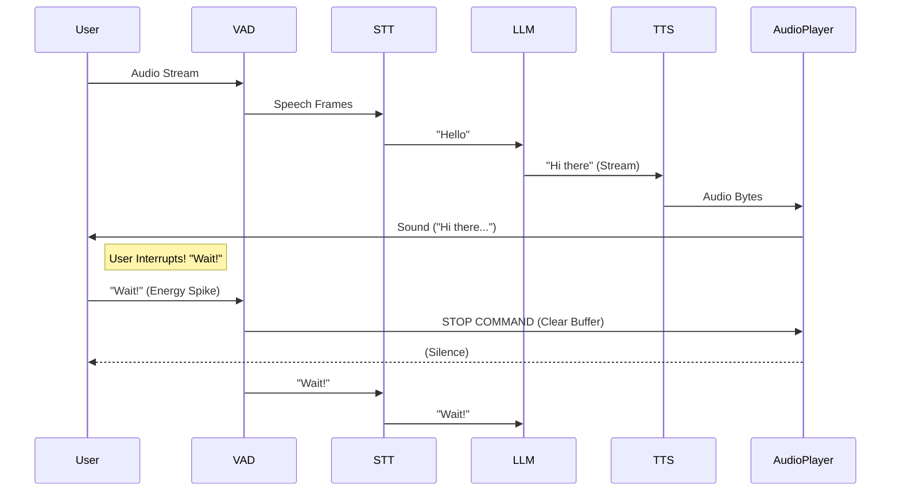

**"Talking to machines: The end of the Keyboard."**

## 1. Introduction: The Universal Interface

Text is an artifact of computing history. Humans don't text each other when they are in the same room; they talk. It is the highest bandwidth, lowest friction interface we have.
Voice Agents represent the Holy Grail of HCI (Human-Computer Interaction): an interface that requires **Zero Training**, **Zero Literacy**, and **Zero Hands**.

However, building a Voice Agent is exponentially harder than a Chatbot.
* **Chatbot:** User sends text. Wait 5s. Response appears. The user can switch tabs. The interface is "Async".
* **Voicebot:** User speaks. Silence. (1s... 2s...) "Why is it silent?" (3s...) "Hello?" The interface is "Sync".
* **Latency Intolerance:** In voice, silence is awkward. It feels like the connection dropped. Research shows that gaps greater than **800ms** significantly decrease "Trust" in the system. Gaps > 1500ms cause the user to think the agent is broken.
* **Noise:** Background chatter, heavy accents, cheap laptop microphones, wind noise.
* **The "Double-Speak" Problem:** The agent talks over the user, creating a cacophony.

In this deep dive, we will architect the full **Voice Pipeline**: `AudioIn -> VAD -> STT -> LLM -> TTS -> AudioOut`. We will explore the vendor landscape, the rigorous cost economics, and the critical control logic that separates a demo from a product.

---

## 2. Component 1: The Ears (STT / ASR)

Speech-to-Text (STT) or Automatic Speech Recognition (ASR). This is the foundation. If the agent mishears "Purchase" as "Perch", the game is over. No amount of LLM intelligence can fix a bad transcript.

### 2.1 The Models Landscape: A Vendor Battle
There is no "One Model Fits All". You typically choose between three categories.

#### A. The Open Source Standard: OpenAI Whisper
* **Architecture:** Transformer trained on 680k hours of weak supervision from the internet.
* **Pros:**
 * **Accuracy:** Unbeatable on English. Even handles heavy accents and murmurs.
 * **Punctuation:** It outputs grammatically correct text with commas and periods (Critical for the LLM to understand meaning).
 * **Price:** Free (Self-hosted).
* **Cons:**
 * **Speed:** It is **Slow**. Standard `whisper-large-v3` takes ~500ms-1s to process 5 seconds of audio on an A100.
 * **Hallucinations:** In silence, it sometimes hallucinates text like "Thanks for watching" (Subtitle artifacts).

#### B. The Speed Demon: Deepgram Nova-2
* **Architecture:** Proprietary E2E Deep Learning.
* **Pros:**
 * **Latency:** Blazing fast. Streaming latency is often ~300ms.
 * **Cost:** Extremely cheap ($0.0043/min).
 * **Phone Optimization:** It performs exceptionally well on low-fidelity (8khz) phone audio.
* **Cons:** Closed source. You are vendor-locked.

#### C. The Intelligence Layer: AssemblyAI / Rev
* **Pros:** Strong focus on "Understanding".
 * **Speaker Diarization:** "Speaker A said X, Speaker B said Y". (Critical for meeting bots).
 * **Sentiment Analysis:** Returns "Anger" metrics alongside text.
 * **PII Redaction:** Automatically masks "SSN: 123-45...".

### 2.2 Streaming vs Batch: The Latency Choice
* **Batch:** Record 10s of audio -> Upload -> Transcribe.
 * *Latency:* 10s (Recording) + 2s (Upload/Process) = 12s. Unusable for live conversation.
* **Streaming (WebSockets):**
 * Client opens WebSocket. Sends raw PCM bytes (chunks of 20ms).
 * Server processes chunks incrementally.
 * Server returns partial transcripts: `("He")` -> `("Hell")` -> `("Hello")`.
 * *Latency:* < 500ms.
 * *Mechanism:* Use **Endpointing**. The STT provider usually tells you "I think the sentence is done" via a `is_final=true` flag. This is your trigger to send the text to the LLM.

---

## 3. Component 2: The Brain (LLM)

The LLM part is standard (GPT-4o / Claude 3.5 Sonnet), but the **Prompt Engineering** is radically different.

### 3.1 Voice-Specific Prompting
* **Brevity:** People read faster than they listen. Reading a paragraph takes 5s. Listening to it (at 150wpm) takes 25s.
 * *Instruction:* "Be concise. Use colloquial language. Do not use lists or bullet points. Avoid markdown."
 * *Bad Response:* "Here are three reasons: 1. Speed, 2. Cost, 3. Quality." (Sounds robotic).
 * *Good Response:* "Well, it mostly comes down to speed, cost, and quality." (Sounds natural).
* **Filler Words:** To mask latency, you can instruct the model or the orchestrator to emit "Fillers" immediately (`"Hmm, let me check..."`, `"Okay..."`, `"Got it."`).
 * *Technique:* **Optimistic Acknowledge.** As soon as STT finishes, play a pre-recorded "Sure!" sound file from the client cache while the server thinks. This buys you 500ms of "perceived" zero latency.

---

## 4. Component 3: The Mouth (TTS)

Text-to-Speech (TTS). The voice *is* the brand.

1. **ElevenLabs:** The gold standard for quality.
 * *Quality:* Indistinguishable from human. Emotional range (can whisper, shout, laugh).
 * *Latency:* High (~500ms - 1s with Turbo).
 * *Cost:* Expensive ($0.15 / 1k chars).
2. **OpenAI TTS (tts-1):** Good quality, highly consistent.
 * *Latency:* Fast (~300ms).
 * *Cost:* Cheap ($0.015 / 1k chars).
 * *Sound:* Slightly robotic/metallic compared to ElevenLabs.
3. **Cartesia (Sonic):** The new speed demon.
 * *Latency:* **~100ms** (Generation Time).
 * *Usage:* Real-time conversational agents where snappy turns matter more than perfect "Radio DJ" voice.
4. **PlayHT:** High fidelity, great cloning capabilities.

**Streaming TTS:** You must stream the audio back. Playing it all at once adds seconds of delay. The TTS engine should yield MP3/PCM chunks as soon as it generates them.

---

## 5. The Critical Control Logic: VAD and Barge-In

This is where most amateur voice agents fail. The ability to handle "Silence" and "Interruption" determines if the user feels listened to.

### 5.1 Voice Activity Detection (VAD)
How does the agent know you finished your sentence?
* *Human:* "I want a burger..." (Pause 500ms) "...and fries."
* *Bad Agent:* Hears "burger". Interrupts: "What kind of burger?"
* *Human:* "...and fries. Shut up."

**The Silence Timeout:**
We configure a VAD threshold (e.g., 700ms of silence). If silence > 700ms, we assume the turn is over.
* **Trade-off:**
 * Short Timeout (300ms): Snappy, but interrupts mid-thought.
 * Long Timeout (1000ms): Polite, but feels sluggish. The agent seems "Slow".
 * *Adaptive Timeout:* Use a fast LLM to predict if the sentence is complete ("I want a..." -> Incomplete. "I want a burger." -> Complete). If incomplete, extend timeout.

### 5.2 Barge-In (Interruption)
If the Agent is speaking, and the User starts speaking, the Agent **MUST** stop immediately.
This requires a complex state transition and robust **Echo Cancellation**.

#### The Echo Cancellation (AEC) Problem
If you play sound out of the speakers, the microphone picks it up.
Without AEC, the Agent hears its own voice loop back into the mic.
1. Agent says "Hello".
2. Mic hears "Hello".
3. VAD detects speech.
4. Agent thinks User spoke.
5. Agent interrupts itself to listen.
6. **Result:** The "Schizophrenic Loop" where the agent stutters endlessly.
* *Solution:* WebRTC has built-in AEC. If building raw Python pipelines, you need libraries like `speexdsp` or hardware DSP.

#### The Interrupt Protocol
1. **Trigger:** VAD detects speech energy while `AgentState == SPEAKING`.
2. **Action 1 (Network):** Send `CLEAR` packet to client. Client immediately wipes its Audio Buffer (stops playing).
3. **Action 2 (Backend):** Kill the LLM generation task (stop paying for tokens). Kill the TTS generation task.
4. **Action 3 (State):** Transition `AgentState` to `LISTENING`. discard the previous context of what the agent *was about to say*.

---

## 6. Architecture Diagram

The flow of data is a Figure-8 loop.

---

## 7. Cost Analysis: The Economics of Voice

Voice is expensive. Text chat is nearly free. Let's do the math for a 10-minute active conversation.

### 7.1 Premium Stack (Deepgram + GPT-4o + ElevenLabs)
* **STT (Deepgram):** $0.0043 / min. (10 mins = $0.043).
* **LLM (GPT-4o):** ~$0.01 / turn. ~10 turns/min = $0.10 / min. (10 mins = $1.00).
* **TTS (ElevenLabs):** $0.15 / min (roughly). (10 mins = $1.50).
* **Total:** **$2.54 per call.**
* *Viability:* Only viable for high-value services (Legal, Medical, Banking).

### 7.2 Economy Stack (Deepgram + GPT-4o-mini + OpenAI TTS)
* **STT (Deepgram):** $0.043.
* **LLM (GPT-4o-mini):** ~$0.001 / turn. (10 mins = $0.10).
* **TTS (OpenAI TTS):** $0.015 / min. (10 mins = $0.15).
* **Total:** **$0.29 per call.**
* *Viability:* Viable for Customer Support, Ordering, consumer apps.

**Business Model:** You generally cannot offer free unlimited voice agents. You need a subscription (SaaS) or usage caps (Credits).

---

## 8. Summary

Voice Agents are a distributed systems problem wrapped in a UX problem.
* **STT/TTS Latency** dominates the first impression.
* **VAD** tuning is the difference between "Smart" and "Annoying".
* **Barge-In** requires rigorous state management to prevent feedback loops.
* **Cost** requires careful model selection.

To manage this complexity, we often rely on dedicated **Voice Frameworks** that abstract away the plumbing of WebRTC and VAD.
