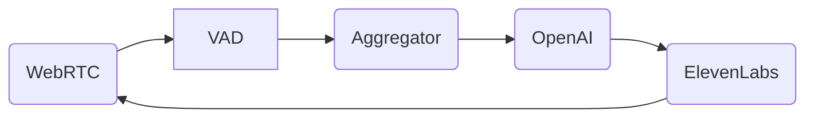

**"Don't build the phone network. Just build the app."**

## 1. Introduction: The WebRTC Nightmare

In Day 16, we built a WebSocket pipeline. That works for server-to-server or simple hobby apps.
But if you want to run a Voice Agent in a browser (Chrome/Safari), connect to a Telephone Line (SIP), or handle bad 4G connections, you enter the world of **WebRTC (Web Real-Time Communication)**.

**Why WebRTC is Hard (The "DIY" Trap):**
1.  **UDP vs TCP:** Real-time audio uses UDP (fire-and-forget). If you lose a packet, you don't re-transmit (it causes lag). You continue. But browsers default to TCP/HTTP.
2.  **NAT Traversal (The "Hello, can you hear me?" problem):**
    *   Your server has a Public IP (e.g., AWS).
    *   The user is behind a home router with a Private IP (`192.168.1.5`).
    *   The router blocks incoming UDP packets by default.
    *   **Solution:** You need **STUN** (Session Traversal Utilities for NAT) servers to tell the user their own public IP. If that fails (Symmetric NAT), you need **TURN** (Traversal Using Relays around NAT) servers to relay *all* data through a middleman. Maintaining global TURN infrastructure is expensive and hard.
3.  **Codecs and Negotiation:** Chrome wants Opus. Safari wants AAC. The SIP line wants G.711 (PCMU). You need to transcode in real-time.
4.  **Jitter Buffers:** Packets arrive out of order. You need a buffer to reassemble audio smoothly without "Robot Voice" artifacts.

Do not write raw WebRTC logic unless you are Google or Zoom. Use an Infrastructure-as-a-Service.

---

## 2. The Infrastructure Layer: LiveKit

**LiveKit** is an open-source project (written in Go) that acts as a scalable **SFU (Selective Forwarding Unit)**. It solves the plumbing.

### 2.1 Concepts
*   **Room:** A virtual space. Users join a room.
*   **Participant:** A user (Human) or an Agent (Bot).
*   **Track:** A stream of media (Audio Track, Video Track).
*   **Publication/Subscription:** Participants *Publish* tracks. Others *Subscribe* to them.

### 2.2 The Agent Architecture
LiveKit introduces a paradigm shift.
*   **Traditional:** The Server "polls" the client.
*   **LiveKit:** The Agent connects to the Room just like a User. It is a "Headless Client".
    *   When a Human joins, the Agent subscribes to their `MicrophoneTrack`.
    *   The Agent processes audio.
    *   The Agent publishes to its own `SpeakerTrack`.

**Benefit:** This automatically handles **Multi-User**. You can have 1 Human + 1 Agent. Or 5 Humans + 1 Agent (Conference Call Agent). Or 1 Human + 5 Agents (Simulated Boardroom). The networking logic remains the same.

---

## 3. The Application Framework: Pipecat

While LiveKit handles the *Network*, you still need to write the *Pipeline Logic* (VAD -> STT -> LLM -> TTS).
**Pipecat** (by Daily) is an open-source Python library specifically for orchestrating these pipelines.

### 3.1 The "Frame" Concept
Pipecat treats data as a stream of **Frames**.
*   `AudioFrame` (Raw PCM bytes).
*   `TextFrame` (String from LLM).
*   `UserStartedSpeakingFrame` (Control signal).

### 3.2 The Pipeline
You define a synchronous list of processors. Data flows through them conceptually like a pipe.



### 3.3 Pipecat Code Walkthrough

```python
# A simple Pipecat Bot
import asyncio
from pipecat.pipeline.pipeline import Pipeline
from pipecat.pipeline.task import PipelineTask
from pipecat.services.openai import OpenAILLMService
from pipecat.services.deepgram import DeepgramSTTService
from pipecat.services.elevenlabs import ElevenLabsTTSService
from pipecat.transports.services.daily import DailyTransport # Or LiveKitTransport

async def main():
    # 1. Transport Layer (The Phone Line)
    # This connects to the Room
    transport = DailyTransport(
        room_url="https://demo.daily.co/test_room",
        token="meet_token"
    )

    # 2. Services (The Organs)
    # We instantiate the services we need.
    stt = DeepgramSTTService(api_key="...", model="nova-2")
    llm = OpenAILLMService(api_key="...", model="gpt-4o")
    tts = ElevenLabsTTSService(api_key="...", voice_id="...")

    # 3. Message Handling (The Logic)
    # Define what happens when context is updated
    messages = [
        {"role": "system", "content": "You are a helpful assistant."}
    ]

    # 4. The Pipeline Definition
    # Flow: Mic -> STT -> LLM -> TTS -> Speaker
    pipeline = Pipeline([
        transport.input(),   # Microphone Input
        stt,                 # Converts Audio Frame -> Text Frame
        llm,                 # Converts Text Frame -> Text Frame (Response)
        tts,                 # Converts Text Frame -> Audio Frame
        transport.output()   # Speaker Output
    ])

    task = PipelineTask(pipeline)
    
    # 5. Run the Event Loop
    # This automatically handles the VAD interrupting the TTS
    await task.run()

if __name__ == "__main__":
    asyncio.run(main())
```

**Key Magic:** The `Pipeline` class handles **Interruption**. If `stt` emits a `UserStartedSpeakingFrame`, the pipeline automatically cancels any pending tasks in `llm` and `tts` to stop the bot from talking.

---

## 4. SIP Trunking: Asking the Agent to make a Phone Call

WebRTC is for the Internet. But businesses run on the **PSTN (Public Switched Telephone Network)**.
How do you connect your cool Python Agent to a +1-800 number?

**SIP (Session Initiation Protocol)** is the standard VOIP protocol.
1.  **Buy a Number:** Use Twilio or Vonage or Telnyx.
2.  **Configure SIP Trunk:** Point the number's "Voice URL" to a **SIP URI** provided by LiveKit (e.g., `sip:my-room@sip.livekit.cloud`).
3.  **The Bridge:** When someone calls the number:
    *   Twilio converts PSTN Audio -> SIP.
    *   LiveKit SIP Egress converts SIP -> WebRTC Room.
    *   Your Agent sees a user join the room.
    *   **Result:** You process a phone call exactly like a web browser user. No code changes.

---

## 5. Comparison: Vapi, Bland, and Retell

If LiveKit/Pipecat is "Platform-as-a-Service" (PaaS) where you write code, there are also "Agents-as-a-Service" (SaaS).

1.  **Vapi.ai / Retell AI:**
    *   **Model:** They host the pipeline (VAD/STT/LLM/TTS). You just provide the System Prompt via API.
    *   *Pros:* Instant setup (5 mins). They handle edge-cases like "Answering Machine Detection" perfectly.
    *   *Cons:* Black box. Hard to customize complex logic (e.g., "If user says X, query internal SQL DB, then reply"). You have to use their "Tool Calling" webhooks which adds latency.
    *   *Cost:* Markup on top of LLM costs (~$0.05/min surcharge).
2.  **Bland AI:**
    *   Specialized for Phone Calling (Telemarketing/Support).
    *   *Pros:* "Hyper-real" voices trained for phones. Can make 1000 calls simultaneously.

**Verdict:**
*   **Use Vapi/Retell:** For prototypes, simple appointment setters, or if you don't have a DevOps team.
*   **Use LiveKit/Pipecat:** For Core Product, complex workflows, RAG integrations, or high-scale where margin and control matter.

---

## 6. Summary

*   **Don't build WebRTC from scratch.** It is a black hole of engineering time.
*   **LiveKit** creates the room and handles video/audio/screen sharing.
*   **Pipecat** creates the bot and handles the VAD/LLM/TTS pipeline.
*   **SIP** connects the phone network to the Agent.

These frameworks standardize the **Transport Layer** so you can focus entirely on the **Intelligence Layer**.

In the next post, we will zoom in on the specific algorithmic challenge of **Voice Activity Detection**: the math of detecting silence.
