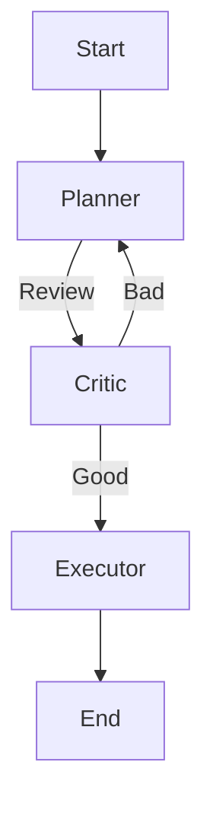

**"An Agent without a Plan is just a stochastic parrot reacting to noise."**

## 1. Introduction

The simpler agents (ReAct) operate in a loop: `Though -> Action -> Observation`. This is sequential.
But complex tasks require parallel planning.
**Task**: "Research 3 companies (A, B, C) and write a comparison report."
-   **Sequential Agent**: Research A (wait), Research B (wait), Research C (wait), Write. Total: 30s.
-   **DAG Agent**: Research A, B, C in parallel. Join results. Write. Total: 10s.

We need to treat Agent Actions not as a "Loop" but as a **Dependency Graph**.

---

## 2. Core Concepts: The Plan-and-Solve Pattern

This pattern separates **Reasoning** from **Execution**.
1.  **Planner**: The LLM generates a DAG.
    -   `Task 1`: Google "Apple stock".
    -   `Task 2`: Google "Microsoft stock".
    -   `Task 3`: Compare (Dep: 1, 2).
2.  **Executor**: A runtime (like Kahn's Algorithm!) executes tasks.
3.  **Replanner**: If Task 1 fails, the Planner updates the graph.

---

## 3. Architecture Patterns: Graphs vs. Chains

-   **Chain**: Linear. `A -> B -> C`. (LangChain Classic).
-   **DAG**: Directed, No Cycles. `A -> B, A -> C, D(B, C)`. (Parallel Execution).
-   **Cyclic Graph**: `A -> B -> A`. (Iterative Refinement).

**LangGraph** is a library designed specifically to define these state machines as graphs.



---

## 4. Implementation Approaches

### 4.1 Static Graph
The developer defines the graph.
-   "Always research, then summarize."
-   Reliable, rigid.

### 4.2 Dynamic Graph (AI-Driven)
The LLM writes the graph.
-   Prompt: "Break this down into subtasks with dependencies."
-   Output: JSON List of Edges.
-   Flexible, fragile.

---

## 5. Code Examples: The Task Graph Executor

A simplified implementation of a DAG runner for agents in Python.

```python
import concurrent.futures

class Task:
    def __init__(self, id, prompt, deps=[]):
        self.id = id
        self.prompt = prompt
        self.deps = deps
        self.result = None

def execute_dag(tasks, llm_function):
    """
    Executes tasks in topological order, running independent tasks in parallel.
    Uses a ThreadPool.
    """
    completed = set()
    with concurrent.futures.ThreadPoolExecutor() as executor:
        futures = {}
        
        while len(completed) < len(tasks):
            # 1. Find runnable tasks
            runnable = []
            for t in tasks:
                if t.id not in completed and t.id not in futures:
                    # Check dependencies
                    if all(d in completed for d in t.deps):
                        runnable.append(t)
            
            # 2. Submit to workers
            for t in runnable:
                # Inject dependency results into context
                context = "\n".join([tasks[d].result for d in t.deps])
                full_prompt = f"Context: {context}\nTask: {t.prompt}"
                futures[t.id] = executor.submit(llm_function, full_prompt)
            
            # 3. Wait for at least one to finish
            # (In production, use as_completed)
            # ... logic to harvest results and add to 'completed' set ...
            
    return tasks
```

This is fundamentally **Kahn's Algorithm** (Day 49 DSA) applied to LLM calls.

---

## 6. Production Considerations

### 6.1 State Management
In a DAG, "State" is shared.
If Task A and Task B run in parallel, and both try to update `memory.txt`, you have a race condition.
**LangGraph** solves this by passing a **State Object** (`TypedDict`) through the edges. The state is immutable-ish (Postgres check-pointed).

### 6.2 Human-in-the-Loop
You might want a human to verify `Task 1` before `Task 2` starts.
The Graph Executor must support **Pause/Resume**. This requires serializing the graph state (Day 47 Agents!) to a DB.

---

## 7. Common Pitfalls

1.  **Hallucinated Cycles**: The LLM plans `Task A` needs `Task B`, and `Task B` needs `Task A`. The executor deadlocks.
    -   *Fix*: Validate the JSON dependency list for cycles using DFS before execution.
2.  **Context Overflow**: Merging results from 10 parallel tasks into the prompt for Task 11 blows up the context window.
    -   *Fix*: Summarize intermediate results (Map-Reduce).

---

## 8. Best Practices

1.  **Map-Reduce Pattern**:
    -   **Map**: "Generate 5 ideas." (Run 5 LLM calls in parallel).
    -   **Reduce**: "Select the best idea." (Run 1 LLM call).
2.  **Visual Debugging**: Use tools like **LangSmith** to visualize the graph execution. Debugging a 50-step async agent via print logs is impossible.

---

## 9. Connections to Other Topics

This connects to **Course Schedule** (DSA Day 49).
-   The Agent *is* the student taking courses.
-   The "Prerequisites" are the information dependencies.
-   "You cannot write the Summary (Course 101) until you read the Book (Course 100)."

---

## 10. Real-World Examples

-   **GPT-Researcher**: A popular open-source agent.
    -   Generates 5 research questions.
    -   Scrapes 5 websites in parallel.
    -   Aggregates into one report.
-   **OpenAI Deep Research**: Uses heavy iterative branching to explore topics depth-first vs breadth-first.

---

## 11. Future Directions

-   **Multi-Agent Graphs**:
    -   Node A is "Coder Agent".
    -   Node B is "Reviewer Agent".
    -   The graph defines the "Company Org Chart".
-   **Self-Modifying Graphs**: The Agent realizes the plan is bad halfway through and re-writes the remaining graph nodes (Runtime Graph Modification).

---

## 12. Key Takeaways

1.  **Parallelism = Speed**: Agents are slow. Parallelizing sub-tasks is the easiest performance win.
2.  **Graph > Chain**: Real world workflows are non-linear.
3.  **State is King**: The edges of the graph transport State. Managing that schema is the hard part of Agent engineering.

---

**Originally published at:** [arunbaby.com/ai-agents/0049-dependency-graphs-for-agents](https://www.arunbaby.com/ai-agents/0049-dependency-graphs-for-agents/)

*If you found this helpful, consider sharing it with others who might benefit.*
