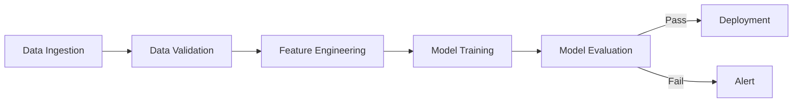

**"Cron jobs are fine for scripts. Pipelines need Orchestrators."**

## 1. Introduction: The "Cron" Trap

When a data scientist starts a project, they write a script: `train.py`.
To run it daily, they add a cron job: `0 0 * * * python train.py`.

This works for a week. Then things get complicated:
1. "Wait, we need to run `clean_data.py` before `train.py`."
2. "But `clean_data.py` needs the `warehouse_export` job to finish first."
3. "And if `train.py` succeeds, we should trigger `deploy.py` only if accuracy > 90%."
4. "Oh, and `warehouse_export` failed today. Can we retry just that part?"

Suddenly, your `crontab` is a mess of timing guesses ("Let's wait 30 mins between jobs and hope it finished"). This is fragile.
You need an **Orchestrator**.

---

## 2. The DAG: Directed Acyclic Graph

In MLOps, we view the entire ML lifecycle as a **DAG**.
- **Nodes**: Units of work (Operators).
- **Edges**: Execution dependencies.

Notice the similarity to **Course Schedule** (Day 49 DSA)?
Just like you can't take Calculus II before Calculus I, you can't Train before you Ingest. The Orchestrator is the Registrar ensuring prerequisites are met.

---

## 3. Why Not Just a Script?

Why do we need complex tools like Airflow or Kubeflow? Why not one big `main.py` that calls functions in order?

### 3.1 Resilience & Retries
If the "Training" step fails after running for 10 hours, a script crashes. Rerunning `main.py` starts from zero (Data Ingestion).
An Orchestrator knows "Ingestion" passed. It restarts *only* the "Training" node, potentially on a different machine.

### 3.2 Parallelism
If you are training 5 models for 5 different regions (US, EU, ASIA...), a script runs them sequentially.
A DAG defines them as independent branches. The Orchestrator spins up 5 workers to run them in parallel.

### 3.3 Heterogeneous Compute
- **Ingestion**: Needs High I/O (RAM).
- **Training**: Needs GPUs.
- **Evaluation**: Needs simple CPU.
An Orchestrator like Kubeflow can execute Step 1 on a CPU Pod and Step 2 on a GPU Pod, optimizing cloud costs.

---

## 4. Key Orchestration Tools

### 4.1 Apache Airflow
The industry standard. Born at Airbnb.
- **Definition**: Python code (`dag.py`).
- **Strengths**: Huge community, rich integrations (S3, Postgres, Slack).
- **Weakness**: Originally designed for Data Engineering (ETL), not specifically ML (passing large tensors between tasks is hard).

### 4.2 Kubeflow Pipelines (KFP)
Native to Kubernetes. Born at Google.
- **Definition**: Python DSL compiles to YAML.
- **Strengths**: Each step is a Docker container. Perfect for ML reproducibility.
- **Weakness**: Heavy infrastructure (requires K8s).

### 4.3 Prefect / Dagster
Modern challengers focusing on developer experience and "data awareness".

---

## 5. Designing a Robust ML Pipeline

When designing your DAG, follow these principles:

### 5.1 Idempotency
**Rule**: Running a task twice should have the same effect as running it once.
- **Bad**: `INSERT INTO table ...` (Running twice duplicates data).
- **Good**: `DELETE WHERE date=today; INSERT ...` (Safe to retry).

### 5.2 Atomic Tasks
Break huge steps into smaller ones.
- **Bad**: `do_everything()` function.
- **Good**: `download`, `validate`, `preprocess`, `train`.
If `preprocess` fails, you don't need to re-download.

### 5.3 Data Validation (The "Circuit Breaker")
Always insert a "Validation" node between Ingestion and Training.
If today's data is empty or corrupted, **fail fast**. Don't waste $500 of GPU time training on garbage.
- Tools: Great Expectations, Pandera.

---

## 6. Architecture: The Control Plane

How does the Orchestrator actually work?

1. **Scheduler**: The heartbeat. It checks the DAGs and the clock. "Is it time to run DAG X? Are dependencies for Task Y met?"
2. **Metadata DB**: State storage. "Task A status: SUCCESS. Task B status: RUNNING."
3. **Executor**: The worker manager. Kubernetes Executor, Celery Executor, Local Executor.
4. **Web UI**: For humans to debug. "Why is my graph red?"

---

## 7. Connection to DSA

The Scheduler uses **Topological Sort** (Kahn's Algorithm) every tick!
1. It looks at all tasks in the DAG.
2. It filters for tasks where `Status != COMPLETED`.
3. It checks In-Degrees (Are upstream parents COMPLETED?).
4. If In-Degree is effectively 0 (all prerequisites met), it adds the task to the Execution Queue.

Without the topological sort algorithm, MLOps capability would not exist.

---

## 8. Summary

As systems mature, **Orchestration** becomes more important than the Model itself. A mediocre model that updates reliably every day is better than a state-of-the-art model that is manually retrained on a laptop once a month.

Use DAGs to turn your ML experiments into ML products.

---

**Originally published at:** [arunbaby.com/ml-system-design/0049-dag-pipeline-orchestration](https://www.arunbaby.com/ml-system-design/0049-dag-pipeline-orchestration/)

*If you found this helpful, consider sharing it with others who might benefit.*
