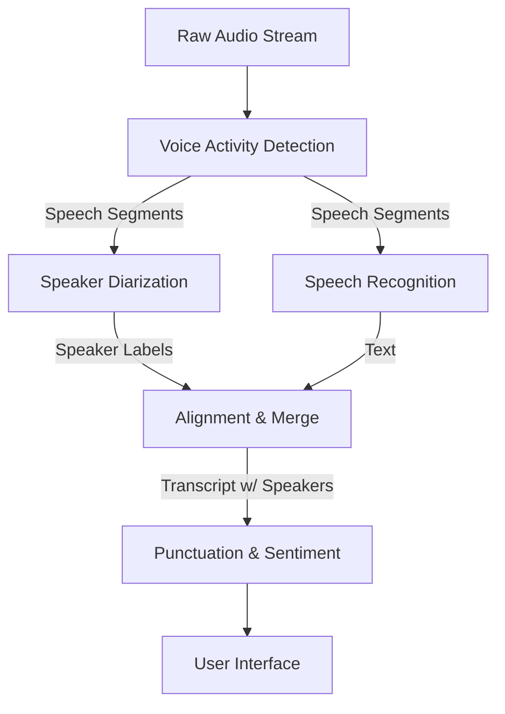

**"Speech isn't just ASR. It's a symphony of models playing in order."**

## 1. Introduction: The Complexity of "Listening"

When you use a tool like **Otter.ai** or **Zoom Transcriptions**, it feels like one magic AI.
Realistically, it is a complex DAG of 5-10 different models executing in a precise order.

If we just ran a massive ASR model on a 1-hour recording, it would fail. It would transcribe silence. It would confuse Speakers A and B. It would hallucinate during noise.
To build a production system, we must decompose the problem into a **Pipeline**.

---

## 2. The Standard Speech Pipeline (The DAG)

Let's look at the dependencies for a meeting transcription bot.



### 2.1 Component breakdown

1. **VAD (Gatekeeper)**:
   - *Input*: Audio Frame (30ms).
   - *Output*: Probability of Speech.
   - *Why*: Dependency for everything. Don't send silence to the expensive ASR model. It saves 50% compute.

2. **Diarization (Who?)**:
   - *Input*: Speech Segment.
   - *Output*: "Speaker 1", "Speaker 2".
   - *Why*: "I hate this" means something very different if said by the Buyer vs. the Seller.

3. **ASR (What?)**:
   - *Input*: Speech Segment.
   - *Output*: "hello world".

4. **Alignment (Sync)**:
   - *Challenge*: Diarization says "Speaker A spoke from 0:00 to 0:05". ASR gives text "Hello world".
   - We must merge these streams accurately.

---

## 3. Dependency Challenges

### 3.1 Error Propagation (The Cascade Failure)
In a DAG, errors flow downstream.
- **Fail 1**: VAD misses a quiet whisper.
- **Result**: ASR never sees the audio. The sentence is lost forever.
- **Fail 2**: Diarization thinks two people are one person.
- **Result**: The transcript attributes the "No" (from Speaker B) to Speaker A. Legal disaster.

This makes debugging hard. Is the ASR bad, or did the VAD just cut the first word?

### 3.2 Latency Addition
In a serial pipeline (A -> B -> C), Latency = Latency(A) + Latency(B) + Latency(C).
- VAD: 30ms
- ASR: 200ms
- NLP: 50ms
- **Total**: 280ms.
Optimization must happen at the bottleneck (usually ASR).

---

## 4. Advanced: Parallelizing the DAG

Notice in our graph that **ASR** and **Diarization** both depend on VAD, but *not on each other*.
This is a critical insight from our Topological Sort (DSA Day 49).

We can run ASR and Diarization **in parallel**.

```python
async def process_segment(audio_segment):
    # 1. Start both tasks concurrently
    task_asr = asyncio.create_task(run_asr(audio_segment))
    task_diar = asyncio.create_task(run_diarization(audio_segment))
    
    # 2. Wait for both
    text = await task_asr
    speaker = await task_diar
    
    # 3. Merge results
    return f"{speaker}: {text}"
```

This reduces the latency to `max(ASR, Diarization)` instead of `sum(ASR + Diarization)`.

---

## 5. End-to-End vs. Pipeline

Recent research (like **Listen, Attend, and Spell** or **Whisper**) tries to collapse the DAG into a single node.
- Input: Audio.
- Output: "Speaker A: Hello. Speaker B: Hi."

**Pros**:
- Simpler deployment (one model file).
- Joint optimization: The model uses text context to help identify speaker changes.

**Cons**:
- Inflexible. You can't just "upgrade VAD" without retraining the whole monster.
- High compute. You run the monster model even for silence.

For now, industry "Meeting Bots" still prefer the Pipeline approach for modularity and cost control (VAD is cheap!).

---

## 6. Real World Example: "Hey Siri"

The pipeline on your phone is extremely strict about dependencies to save battery.

1. **Stage 1 (Low Power DSP)**: Always listening buffer. Dependencies: None. Detection: "Is there energy?"
2. **Stage 2 (Small Neural Net)**: Wake Word Detector. Dependency: Stage 1 Energy > Threshold. Detection: "Is it 'Siri'?"
3. **Stage 3 (Main ASR)**: Cloud/On-Device Large Model. Dependency: Stage 2 Confidence > Threshold. Action: "Process Command."

If Stage 3 ran constantly, your battery would die in 1 hour. The DAG saves your battery.

---

## 7. Summary

Building a speech product is an exercise in **Systems Integration**.
You are the architect of a graph where audio flows in, passes through gates (VAD), splits into parallel branches (ASR/Diarization), and recombines into a structured transcript.

Understanding the dependencies allows you to optimize for **Cost** (filter early) and **Latency** (parallelize independent branches).

---

**Originally published at:** [arunbaby.com/speech-tech/0049-speech-pipeline-dependencies](https://www.arunbaby.com/speech-tech/0049-speech-pipeline-dependencies/)

*If you found this helpful, consider sharing it with others who might benefit.*
